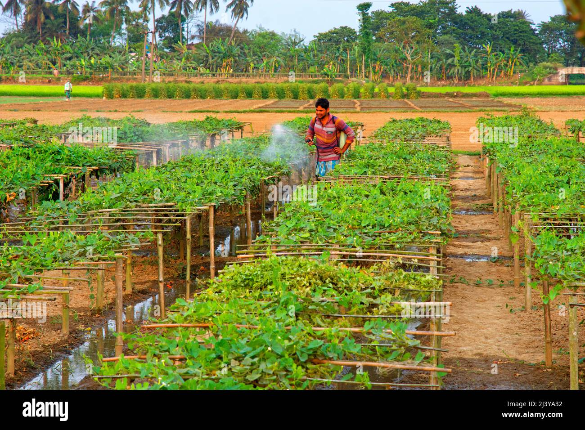

<!DOCTYPE html>
<html>
    <head>
        <title>My first and special website</title>
    </head>
    <body>
    
    <h1>Effort of farmer in a village</h1>
    
Farmer is the back bone of country

        
      
Farmer is the back bone of countryAs we have mentioned earlier, farmers are the lifeline of the trajectory of the Indian agricultural setup. Farmers not only decide the crop yield of a season but also the types of crops being produced. Several journals available online will stress the importance of framers in running an economy and a society.

A season of the bad crop will inevitably increase the price of crops and be a burden on the commoner. Indian farmers have to bear the pang of an uncertain monsoon. Monsoons in the Indian Subcontinent and often erratic and present themselves at unpredictable intervals. The farmers have to be responsible for tracking seasonal changes. Indian farmers are given several benefits by the Government.

        
      
       </h3>
    </body> 
</html>
